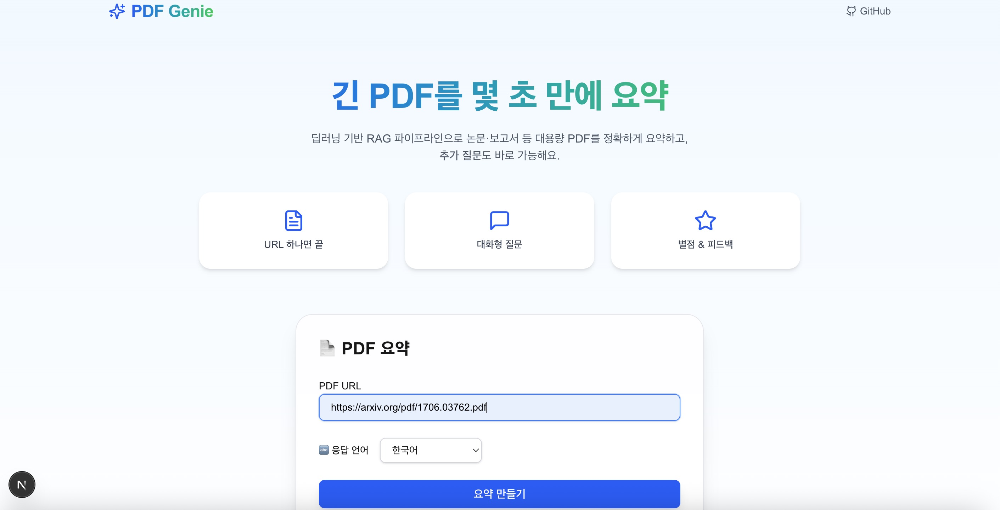
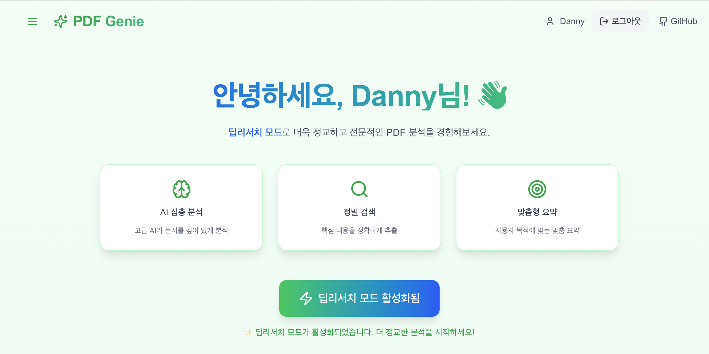
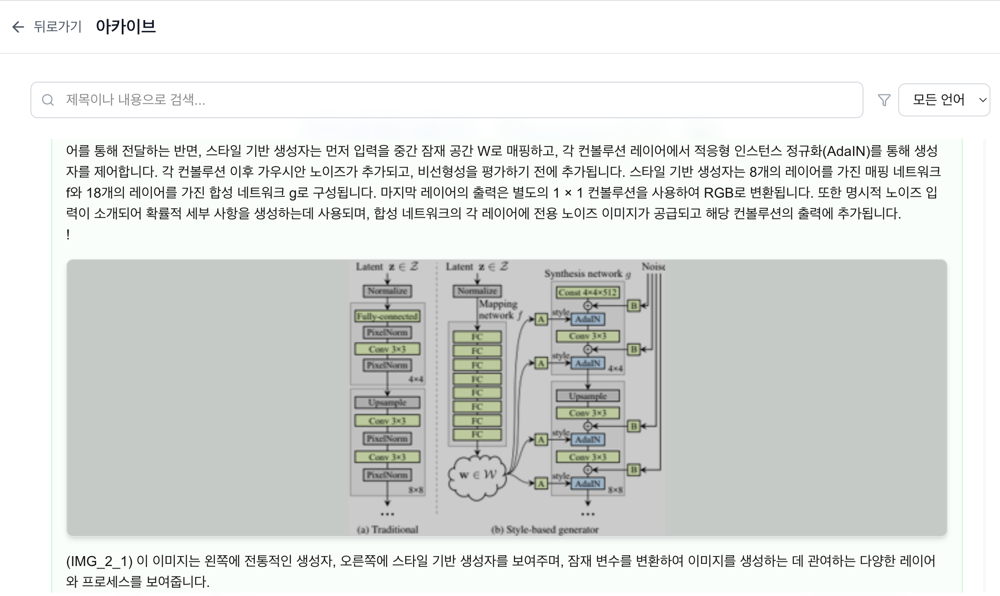
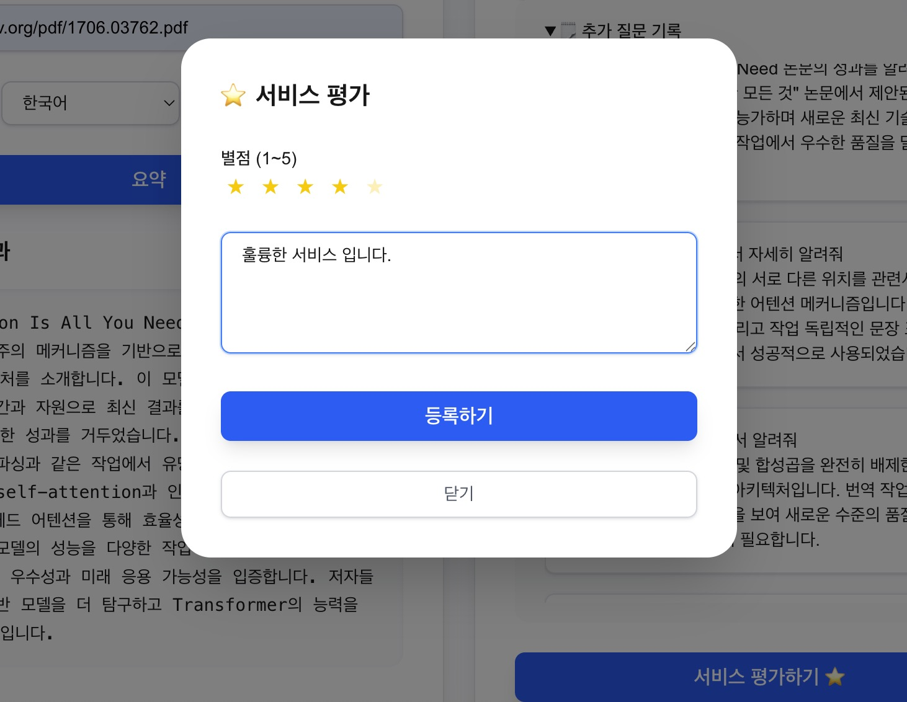

# PDF Genie - AI 기반 PDF 분석 플랫폼

LLM을 활용해 PDF 문서를 요약하고, 질문에 답하고, 학습 자료를 자동으로 생성하는 웹 애플리케이션입니다.

## 주요 기능

<p>
  
  
  
</p>

### 1. PDF 요약 및 질의응답
- PDF URL 입력만으로 전체 문서 요약
- RAG 기반 추가 질문 기능
- 한국어, 영어, 중국어, 일본어 지원

### 2. 딥리서치 모드 (로그인 사용자)
- 더 심층적인 PDF 분석
- 문서 구조화 및 핵심 내용 추출
- 사용자 맞춤형 요약

### 3. 튜토리얼 자동 생성
- PDF를 기반으로 학습 자료 자동 생성
- Markdown 형식의 구조화된 문서
- 이미지 자동 추출 및 배치

<p align="center">
  
  
</p>

### 4. 아카이브 & 피드백
- 생성한 요약/튜토리얼 저장 및 관리
- 별점 및 코멘트로 서비스 개선

## 기술 스택

**프론트엔드**
- Next.js 15 (App Router)
- React 19
- TypeScript
- Tailwind CSS 4
- Framer Motion (애니메이션)
- react-markdown (Markdown 렌더링)

**백엔드** (별도 저장소: `ucware_Deep_research_final`)
- FastAPI
- LangGraph (AI 워크플로우)
- OpenAI GPT-4o
- ChromaDB (벡터 저장소)
- Redis (캐싱)

## 프로젝트 구조

```
src/
├── app/
│   ├── layout.tsx              # 전역 레이아웃
│   └── page.tsx                # 메인 페이지
├── components/
│   ├── auth/                   # 로그인, 회원가입
│   ├── common/                 # 공통 컴포넌트 (Spinner, Stars 등)
│   ├── layout/                 # 사이드바
│   ├── pages/                  # 프로필, 아카이브 페이지
│   └── PdfSummaryForm/         # PDF 요약 폼 (메인 기능)
├── contexts/                   # React Context (Auth, Archive)
└── utils/                      # 유틸리티 함수
```

## 설치 및 실행

### 필수 조건
- Node.js 18+
- 백엔드 서버 실행 중 (`http://localhost:8000`)

### 개발 환경 실행

```bash
# 저장소 클론
git clone https://github.com/CODEHakR1234/ucware-llm-website-v2.git
cd ucware-llm-website-v2

# 의존성 설치
npm install

# 환경 변수 설정
echo "NEXT_PUBLIC_API_URL=http://localhost:8000" > .env.local

# 개발 서버 실행
npm run dev
```

브라우저에서 `http://localhost:3000` 접속

### 프로덕션 빌드

```bash
npm run build
npm start
```

## 사용법

### 일반 요약
1. PDF URL 입력 (예: arXiv 논문 링크)
2. 언어 선택
3. "요약 만들기" 클릭
4. 결과 확인 후 추가 질문 가능

### 딥리서치 모드
1. 로그인 후 "딥리서치 모드로 전환" 클릭
2. "딥리서치 요약" 또는 "튜토리얼 생성" 선택
3. 결과를 아카이브에 저장하고 관리

## 주요 컴포넌트

### PdfSummaryForm
- 메인 폼 컴포넌트
- 3가지 모드: 일반 요약 / 딥리서치 / 튜토리얼
- 파일 ID 관리 (URL 해시 기반)
- API 호출 및 상태 관리

### MarkdownPreview
- Markdown 렌더링
- 이미지 참조 자동 변환 (`[IMG_X_Y]` → 실제 이미지)
- 코드 하이라이팅
- 미리보기/전체보기 모드

### ImagePreview
- 이미지 썸네일 및 전체화면 모달
- 반응형 디자인

## API 엔드포인트

| 엔드포인트 | 메서드 | 설명 |
|-----------|--------|------|
| `/api/summary` | POST | PDF 요약 또는 질문 응답 |
| `/api/tutorial` | POST | 튜토리얼 자동 생성 |
| `/api/feedback` | POST | 사용자 피드백 제출 |

요청 예시:
```json
{
  "file_id": "fid_abc123_paper_pdf",
  "pdf_url": "https://arxiv.org/pdf/1706.03762.pdf",
  "query": "SUMMARY_ALL",
  "lang": "KO"
}
```

## 배포

### Vercel (권장)
1. Vercel에 GitHub 저장소 연결
2. 환경 변수 `NEXT_PUBLIC_API_URL` 설정
3. Deploy

### Docker
```bash
docker build -t pdf-genie .
docker run -p 3000:3000 -e NEXT_PUBLIC_API_URL=https://api.example.com pdf-genie
```

## 트러블슈팅

### "Failed to fetch" 오류
백엔드 서버가 실행 중인지 확인:
```bash
curl http://localhost:8000/api/health
```

### 이미지가 표시되지 않음
- `next.config.ts`에서 API 프록시 설정 확인
- CORS 헤더 설정 확인
- 브라우저 콘솔에서 이미지 요청 URL 확인

### Markdown 렌더링 오류
- 브라우저 개발자 도구에서 원본 Markdown 확인
- `[IMG_X_Y]` 패턴 변환 확인

## 개발 참여

버그 리포트나 기능 제안은 [GitHub Issues](https://github.com/CODEHakR1234/ucware-llm-website-v2/issues)에 올려주세요.

Pull Request 환영합니다:
1. Fork 후 feature branch 생성
2. 변경사항 commit
3. PR 생성

## 라이선스

MIT License

© 2025 UCWORKS

---

**개발**: UCWORKS X SKKU Team | 이학명 (Frontend)  
**GitHub**: [ucware-llm-website-v2](https://github.com/CODEHakR1234/ucware-llm-website-v2)
